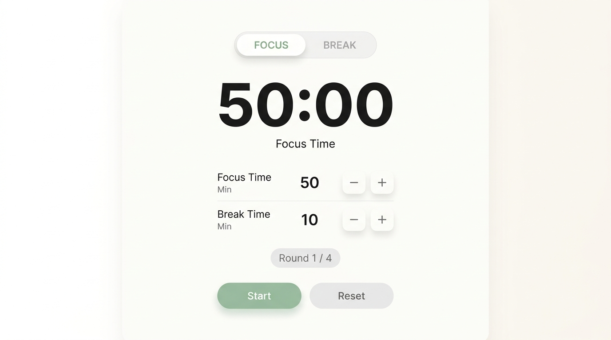

# แบบจำลอง UI: Pomodoro Focus Timer (Light Minimalist Custom)

### จุดเด่นและการออกแบบตามสั่ง
1. **ธีมขาวนวลสบายตา (Soft Warm White):** ใช้โทนสีขาวและเทาอ่อนสไตล์สแกนดิเนเวียน ลดความล้าของสายตาเมื่อเปิดทิ้งไว้ข้างจอตอนอ่านหนังสือหรือเขียนโค้ด
2. **ไม่ใช้วงกลม (Pure Minimal Typography):** แสดงผลเวลา `50:00` ด้วยตัวเลขอักษรตัวหนาเรียบง่าย ชัดเจน มองเห็นได้จากระยะไกล
3. **แท็บสลับโหมดด้านบน:** เม็ดแคปซูล `FOCUS` และ `BREAK` เพื่อให้รู้สถานะปัจจุบันทันที
4. **ปุ่มปรับแต่งเวลา (Custom Steppers):**
   - **Focus Time (Min):** ค่าตั้งต้น `50` พร้อมปุ่ม `[-]` และ `[+]` ปรับลด-เพิ่มได้ตามใจชอบ
   - **Break Time (Min):** ค่าตั้งต้น `10` พร้อมปุ่ม `[-]` และ `[+]`
5. **ตัวนับรอบ (Round Status):** ป้ายบอก `Round 1 / 4` อยู่เหนือปุ่มควบคุม
6. **ปุ่มคำสั่งหลัก:** ปุ่ม Start สีเขียวเซจ (Sage Green) และปุ่ม Reset สีเทาอ่อนเรียบหรู
